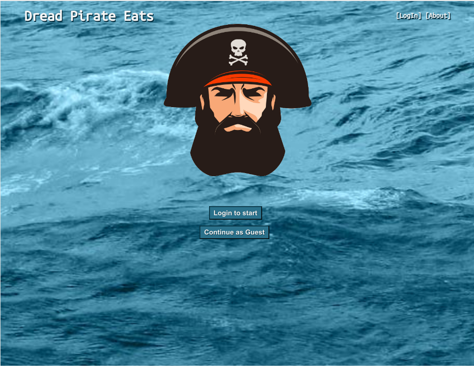
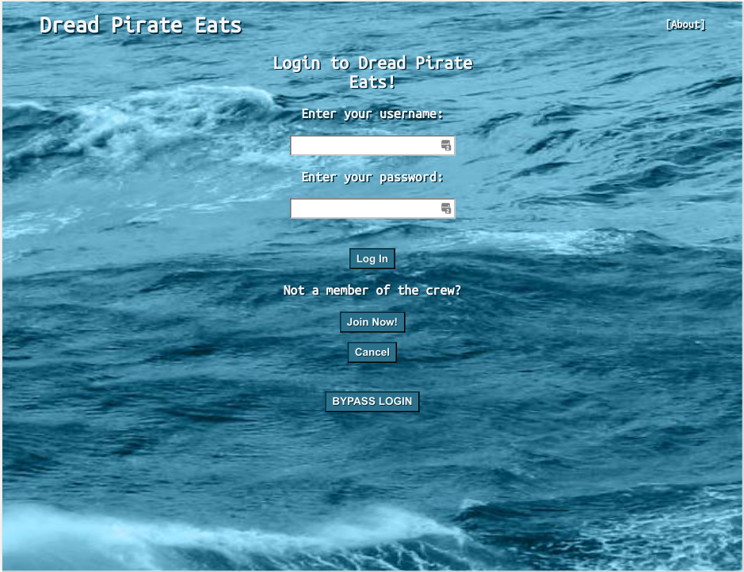
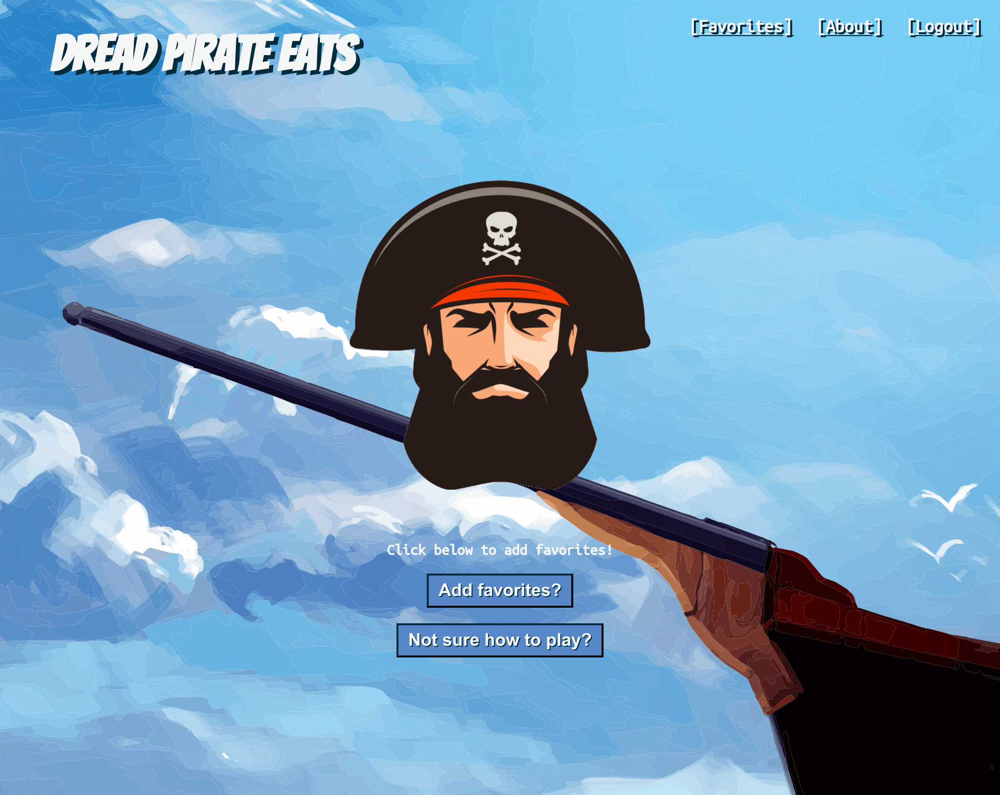
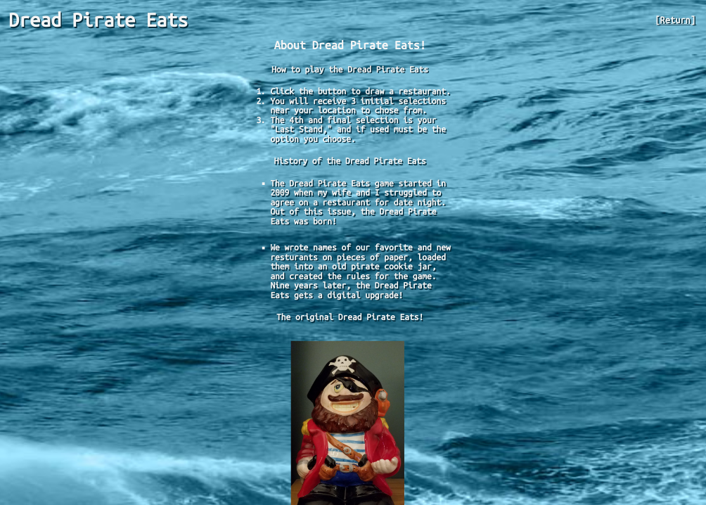
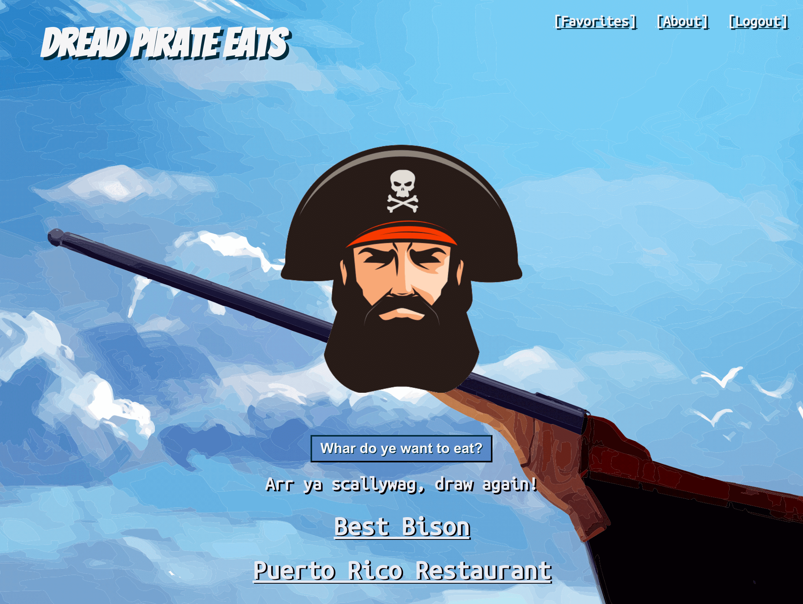
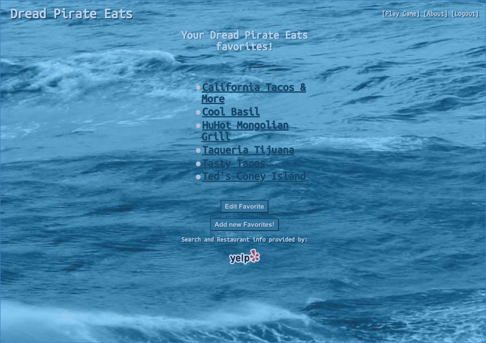
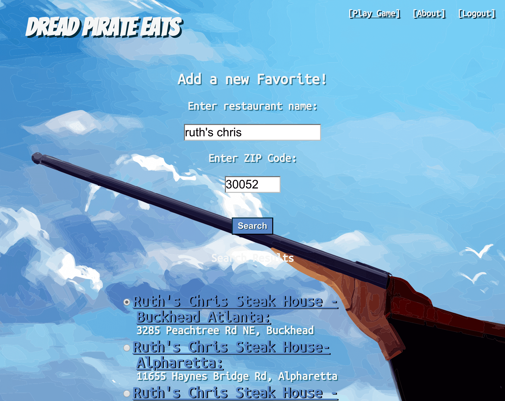
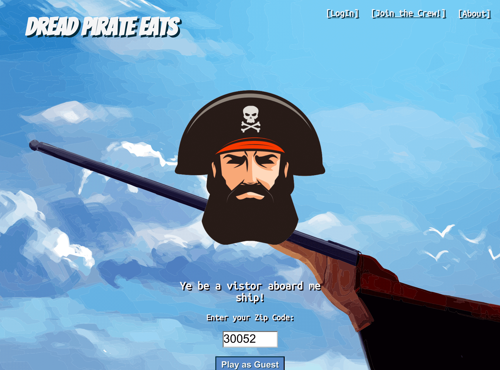
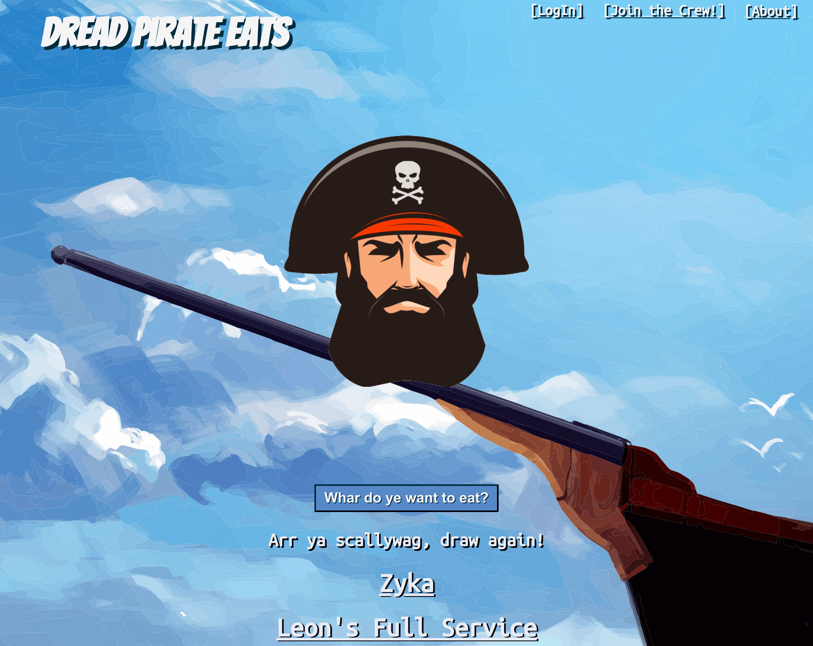

#   Dread Pirate Eats

##  About:

I created this project for my Full Stack Capstone project while enrolled at Thinkful.
The application is a basic game that helps users choose a place to eat.  They can play as a registerd user allowing them to play using their own favorites or as a guest that will search and present options from the area provided by the user.

*   Users start with the option to login to an account or play as a guest.  

    

*   Returning users can login by providing their username and password.
    *   During login a JWT is created and saved to the browser session storage.  It is used to authenticate access to various endpoints required to retrieve and save data.
    *   For this demonstration MVP a 'Bypass Login' button has been provided, allowing users to quickly access a demo version of the application.

    

*   If a user is new they are presened the option to create a new account.  

    

    *   Once account creation is successful the user is automatically authenticated and can start creating favorites and playing right away or learn how to play by clicking [About] or the presented 'Not sure how to play?' button.
    

    *   By clicking [About] or the  'Not sure how to play?' button the user can learn how the game is played and some history behind it's creation.
    

*   Once logged in to their account a user is able to begin drawing from their favorites right away.  
    *   If a user does not have favorites they are directed to create them before playing.  
    *   As you can see in the screenshot, the favorites are displayed on screen and link to the cooresponding page on Yelp, where the user can get additional details and read reviews.

    

*   Clicking the [Favorites] link displays a list of the users favorites.  
    *   Selecting the radio buttons allows a user to edit a favorites name or delete a favorite after clicking the 'Edit Favorite' button.  
    

    *   By clicking the 'Add new Favorite' button the user is given the oportunity to provide a restaurant name and Zip Code to retrieve search results from Yelp.  
    

*   Guest play is similar to that of an account holder.  The guest provides the Zip Code they would like to search, results are temporarily saved and the user is presened with restaurant options until their number of draws has completed.
    
    *   Restaurants are displayed on screen and link to the cooresponding page on Yelp, where the user can get additional details and read reviews.
    

##  Technology used:

*   bcryptjs
*   Chai/Chai-http
*   CORS
*   CSS
*   Enzyme
*   Express.js
*   Faker
*   Git/GitHub
*   Heroku
*   HTML
*   JavaScript
*   Jest
*   JSON Web Token
*   JSX
*   jwt-decode
*   mLab
*   Mocha
*   Mongo DB
*   Mongoose
*   Morgan
*   Node.js
*   Passport.js
*   Postman
*   ReactJS
*   React-Redux
*   Redux-Thunk
*   Travis CI

##  Access and testing:

Users can access the application at the below URL:

*   Front-end
    *   https://shielded-eyrie-90605.herokuapp.com

* API
    *   https://stark-badlands-90054.herokuapp.com

Users can create new users, use the login bypass or use the demo credentials below.

**Test Usernames:**

*   Username: ricksanchez
*   Password: test9033

## API Documentation
*   https://documenter.getpostman.com/view/4606197/RznELe9D#8455d3f4-a6fb-4022-852e-a9e1aefe4a9b

